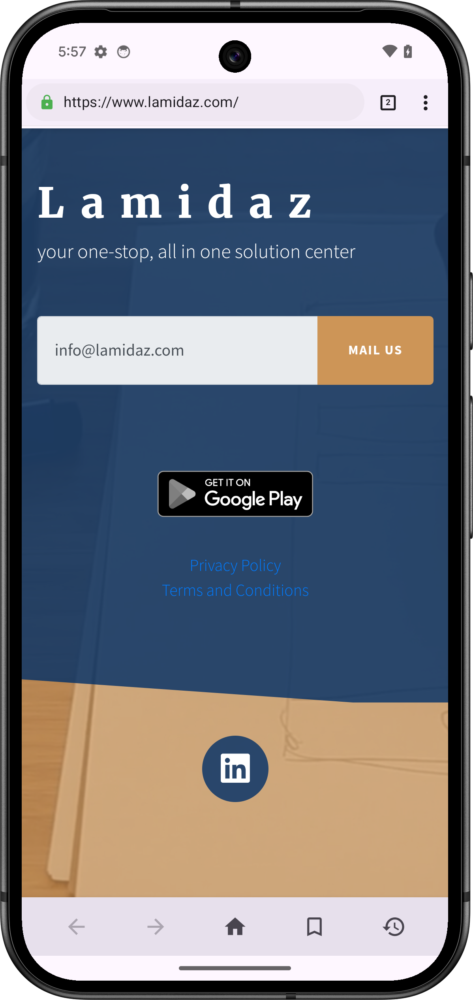
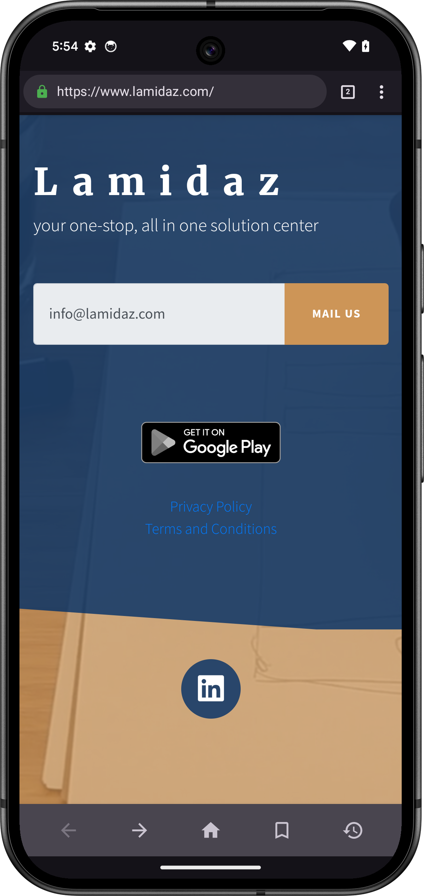
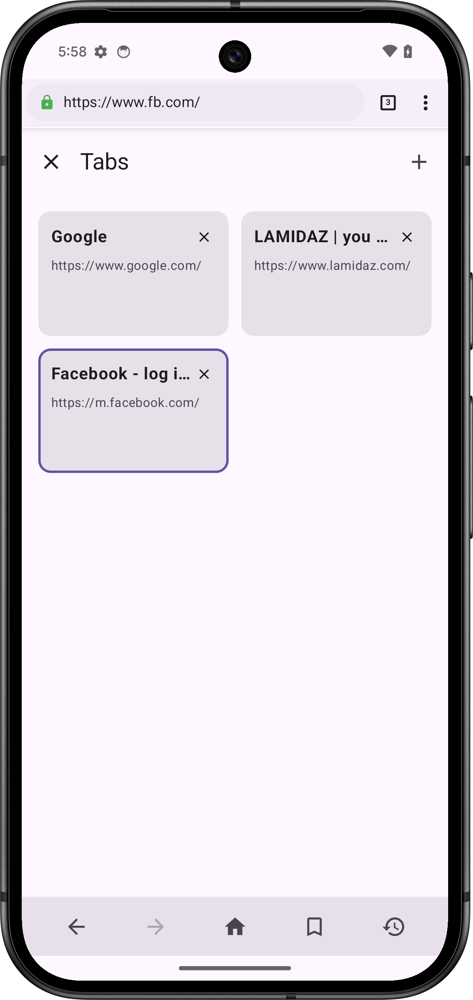
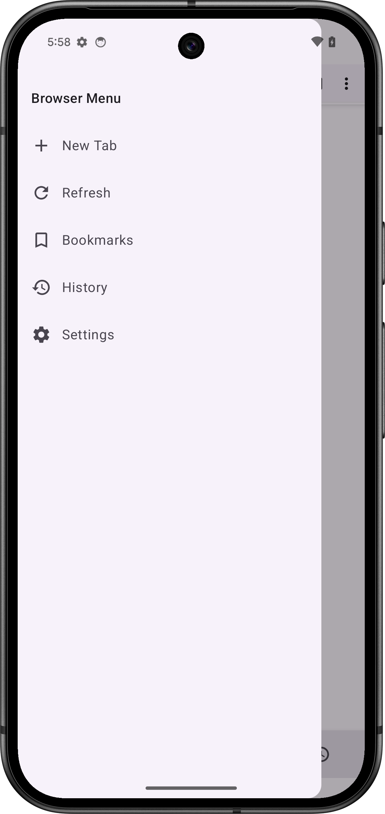
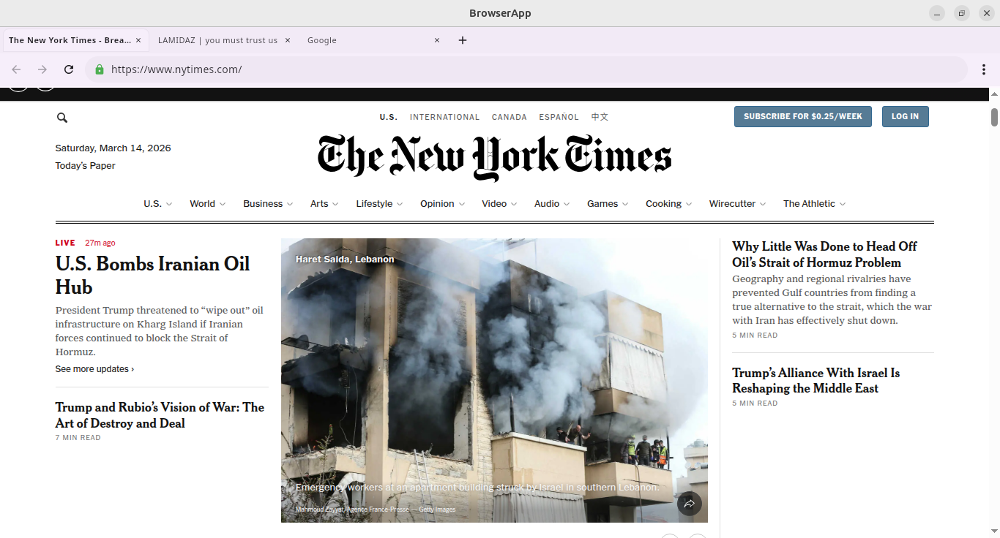
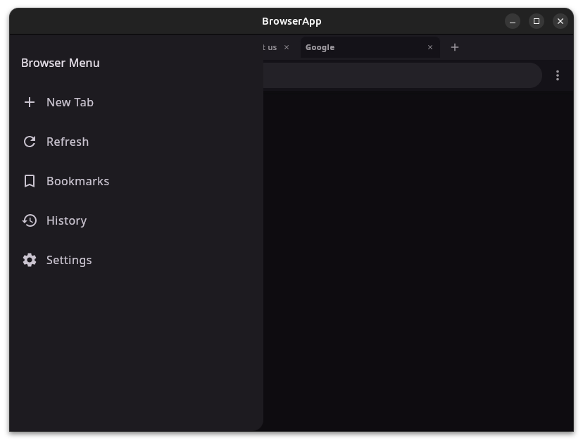

# BrowserApp - Kotlin Multiplatform Browser

A modern, cross-platform web browser built using **Kotlin Multiplatform (KMP)** and **Jetpack Compose Multiplatform**. It supports Android, iOS, and Desktop (JVM) using a shared UI and logic codebase.

## 🚀 Features

- **Multi-platform Support**: Runs on Android, iOS, and Desktop (Windows/macOS/Linux).
- **Tab Management**: Efficiently handle multiple browsing tabs with persistent state.
- **Persistent Storage**: Uses **androidx.datastore** for cross-platform settings and theme preferences.
- **Dependency Injection**: Powered by **Koin** for clean and scalable architecture.
- **Material 3 UI**: Modern and responsive design using Compose Multiplatform.
- **Web Engine**: Powered by [Compose WebView Multiplatform](https://github.com/KevinnZou/compose-webview-multiplatform) for high-performance web rendering across all platforms.
- **Theme Support**: Light, Dark, and System theme synchronization.

## Upcoming Features (Under Development)

- 📌 **Bookmarks & History**: Implementation using **Room DB** for persistent browsing data.
- 🌍 **Multi-localization Support**: Adding support for multiple languages.
- 🛠️ **Enhanced Settings**: More granular control over browser behavior.

## 📸 Screenshots

### Android
<p align="center">
  
  
  
  
</p>

### Desktop (JVM)
<p align="center">
  
  <br>
  
</p>

## 🛠️ Built With

- [Kotlin Multiplatform](https://kotlinlang.org/docs/multiplatform.html)
- [Compose Multiplatform](https://www.jetbrains.com/lp/compose-multiplatform/)
- [Koin](https://insert-koin.io/) - Dependency Injection
- [DataStore](https://developer.android.com/jetpack/androidx/releases/datastore) - Multiplatform Preferences
- [Compose WebView Multiplatform](https://github.com/KevinnZou/compose-webview-multiplatform)

## 🏗️ Getting Started

### Prerequisites
- **Android Studio Ladybug** or later.
- **Xcode** (for iOS development).
- **JDK 17** or higher.

### Running the App

#### Android
1. Open the project in Android Studio.
2. Select the `composeApp` run configuration.
3. Choose an emulator or physical device and click **Run**.

#### Desktop
Run the following Gradle task:
```bash
./gradlew :composeApp:run
```

#### iOS
1. Open the `iosApp/iosApp.xcworkspace` in Xcode.
2. Select your target device/simulator and click **Run**.
*(Or use the Android Studio KMP plugin run configuration)*

## 📂 Project Structure

- `composeApp/src/commonMain`: Shared UI and business logic.
- `composeApp/src/androidMain`: Android-specific implementations.
- `composeApp/src/iosMain`: iOS-specific implementations.
- `composeApp/src/jvmMain`: Desktop-specific implementations (utilizing KCEF).
- `iosApp`: Native iOS project wrapper.

---

**Note:** This is a learning project. You can find the older version of this project at [TheHasnatBD/browserApp](https://github.com/TheHasnatBD/browserApp). The legacy Android-only project has been moved to the `legacy-android` branch.

## 📄 License
This project is licensed under the MIT License - see the [LICENSE](LICENSE) file for details.
